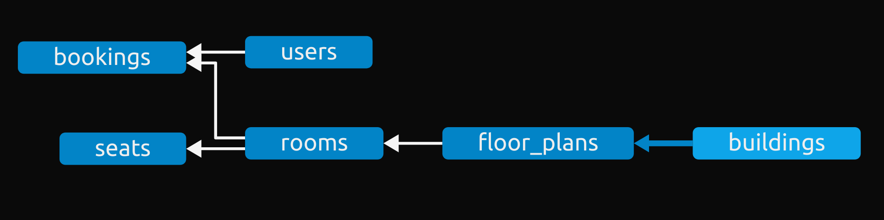

# Case Study
## Intelligent Floor Plan Management System for a Seamless Workspace Experience
### Admin's Floor Plan Management (Onboarding/Modifying the floor plans):
- `Objective`: Develop features for administrators to upload floor plans, addressing potential conflicts during simultaneous updates.
- `Tasks`:
    - Develop a conflict resolution mechanism for simultaneous seat/room information uploads.
    - Implement a version control system to track changes and merge floor plans seamlessly.
    - Resolve conflicts intelligently, considering factors such as priority, timestamp, or user roles.
### Offline Mechanism for Admins (For the UI person):
- `Objective`: Implement an offline mechanism for admins to update the floor plan in scenarios of internet connectivity loss or server downtime.
- `Tasks`:
    - Develop a local storage mechanism for admins to make changes offline.
    - Implement synchronization to update the server when the internet or server connection is re-established.
    - Ensure data integrity and consistency during offline and online transitions.
### Meeting Room Optimization (Meeting Room Suggestions and Booking):
- `Objective`: Enhance the system to optimize meeting room bookings, suggesting the best meeting room based on capacity and availability.
- `Tasks`:
    - Develop a meeting room booking system considering the number of participants and other requirements.
    - Implement a recommendation system to suggest meeting rooms based on capacity and proximity.
    - Ensure dynamic updates to meeting room suggestions as bookings occur and capacities change.
    - Show the preferred meeting room based on the last booking weightage.

----------------------------------------------------------------

# Implementation - FMS (Floor Management System)
## Features Implemented
- Designed a database scheme with:
    - Designed such that easily modifiable and extentable
    - CASCADING such indpendent child entries entries will be deleted along with parent entries, for example, `Floors and Rooms are also removed along with Building`
    - Implemented pre-checks before uploading child entries such that blocking when no parent entry exists, for example, `There can't be floor without Building`
    - Created an interface for each creation and destrution of Entities
    - Database Schema: 
        

- Implemented neat, impressive and secure website with `authentication`
- Added a `Your Activity` Page to `cancel the booking` previously done.
- Added a `Reservation Page` to Book the rooms.
- Running the database on `celery` such that requests can be populated over `flask`, which will whenever the `celery server is up`
- A interactive `workspace page` to add and delete the floor plans, building, rooms and seats.


# Running the WebApp - FMS
Its better you create `virtualenv` to run the project.
1. Install the requirements from `requirements.txt file`
```
$ pip install -r requirements.txt
```
2. Install the redis-server and start it (for celery)
```
$ sudo apt install redis-server
$ redis-server
```
3. start the celery_app first
```
$ celery -A make_celery worker --loglevel INFO
```
4. Now start he task_app in separate terminal
```
$ flask -A task_app run --debug
```
